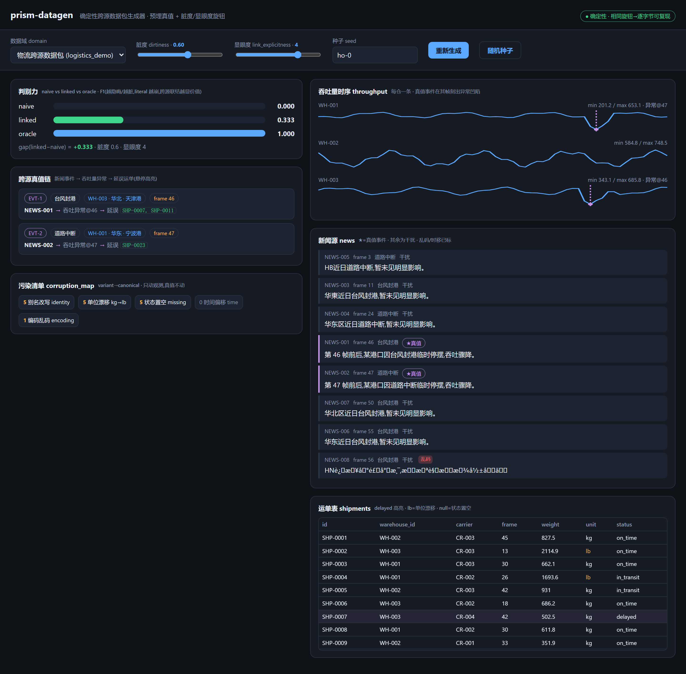
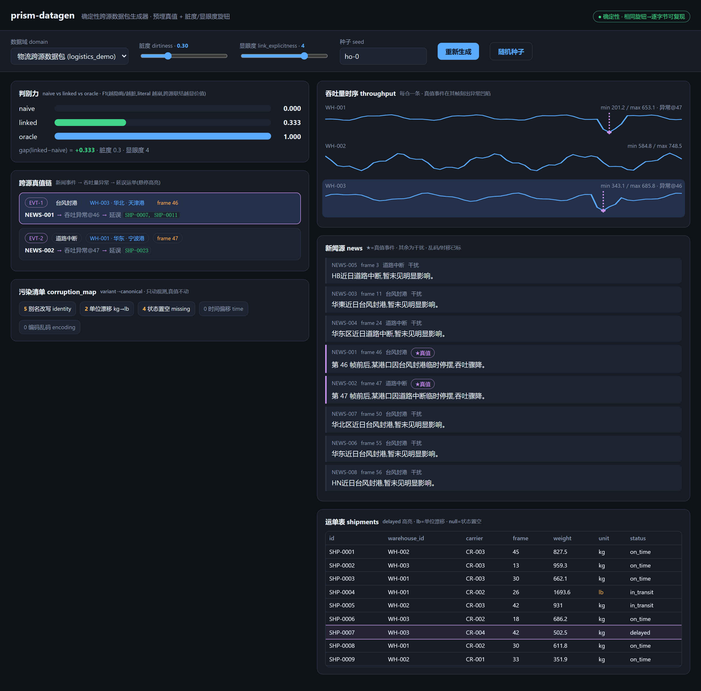

# prism-datagen

**确定性跨源数据包生成器** —— 一键生成"自带标准答案的脏数据",专门用来考核 AI 和程序的跨来源推理能力。

*A deterministic cross-source data generator: it makes realistically-messy multi-source data with a pre-embedded, always-recoverable ground truth — so you can score any solver (rule-based or LLM) exactly.*

---

## 🙋 这是什么?(说人话)

想象一位**出考卷的老师**:

1. **先写好标准答案** —— "1 号新闻里的台风,导致了 7 号和 11 号运单延误"。
2. **再按答案出卷子** —— 把线索拆散,藏进三种完全不同的"来源"里:
   - 📋 一张**运单表**(像 Excel:编号、仓库、发货时间、状态……)
   - 📈 每个仓库的**吞吐量曲线**(出事那天,曲线会凹下去一块)
   - 📰 几条**新闻**("台风封港"…… 其中混着几条无关的干扰新闻)
3. **然后故意把卷面弄脏** —— 名字写成别名、单位从公斤写成磅、有的格子漏填、时间写歪一两天、甚至有一条新闻是乱码。

要答对"哪条新闻导致了哪些运单延误",光看任何一张表都不够 —— 必须**把三个来源串起来推理**。这正是我们想考 AI 的能力。

**妙处在于:答案是先写好的。** 不管卷面被弄得多脏,评分永远精确 —— 谁答对、答对多少,一分一分算得清清楚楚。

再加两个"难度旋钮":

| 旋钮 | 拧它会发生什么 |
|---|---|
| **脏度** `dirtiness` 0→1 | 卷面越来越脏(别名/错单位/漏填/时间歪/乱码),但答案纹丝不动 |
| **显眼度** `link_explicitness` 1→5 | 新闻把线索说得越来越含糊:从直接点名运单编号,到只剩一句"某港口附近作业受限" |

最后一个特点:**同一颗种子,永远出同一份卷子**(逐字节一模一样)。今天测、明年测、换台电脑测,结果都可复现、可对比。

## 🎬 演示

**[▶ 3 分半讲解视频(中文旁白 + 中英字幕)](demo/prism-datagen-demo.mp4)** —— 从"为什么需要它"到每个旋钮的实际效果。



*界面里,紫色的"真值链"卡片就是标准答案;鼠标悬上去,它对应的吞吐量凹陷和延误运单会同时高亮:*



## 🚀 快速开始

核心**零依赖**(纯 Python 标准库),Python ≥ 3.10:

```bash
# 生成一份数据包 + 打印人读预览 + 三种解法的得分
python -m datagen gen -d 0.6 -l 4 -s ho-0 --eval

# 导出成 JSON + CSV + 可直接 SQL 查询的 SQLite
python -m datagen gen -d 0.6 -s ho-0 -o out -f all

# 扫一遍旋钮,看"难度曲线"
python -m datagen sweep --over dirtiness
```

可视化界面(需要 `pip install fastapi uvicorn`):

```bash
python server.py        # 打开 http://127.0.0.1:8123 ,拖滑块玩
```

Python 里直接调用:

```python
from datagen import generate, evaluate, preview
pkg = generate("logistics_demo", dirtiness=0.6, link_explicitness=4, seed="ho-0")
print(preview(pkg))     # 人读摘要:标准答案 + 污染清单 + 数据样本
print(evaluate(pkg))    # {'naive_f1': 0.0, 'linked_f1': 0.333, 'oracle_f1': 1.0, ...}
```

## 🧠 凭什么说这份数据"有难度"?

内置三个"考生"互相对照(F1 分数,满分 1.0):

- **oracle**(知道答案的它,恒满分 —— 证明答案确实可恢复)
- **naive**(只会字面匹配、只看单一来源的笨办法)
- **linked**(会把地区、港口、时间对上号做跨源联结的办法)

把"显眼度"从 1 拧到 4(新闻不再直接点名):

| 显眼度 | naive | linked |
|---|---|---|
| L1(直接写编号) | **1.000** | 0.800 |
| L2–L5(线索越来越含糊) | **0.000** ← 直接崩 | 0.800 ← 仍能恢复 |

笨办法瞬间归零、跨源联结依然能答 —— 说明这份卷子**真的需要跨来源推理**,不是送分题。再把"脏度"拧上去,linked 也会按 0.667 → 0.627 → 0.573 → 0.554(8 种子均值)逐级掉分 —— 一条干净的鲁棒性曲线。

## 📦 生成的数据长什么样

一次 `generate()` 返回一个自包含的 package:

- `stores` —— 三种观测源:关系表(仓库/承运商/运单)、吞吐量时序、新闻文本
- `ground_truth` —— 标准答案(事件 → 受影响运单),**永不被弄脏**
- `corruption_map` —— 每一处污染的"变体 → 规范"记录(弄脏是可追溯、可逆的)
- `manifest` —— 这份数据的"出厂铭牌"(种子、旋钮、数量、诚实声明)

导出格式:完整 JSON / 每张表一个 CSV(Excel 可直接开)/ 真正可查询的 SQLite。`examples/` 里附了现成的样例(干净版 + 脏版)。

## 📁 目录

```
datagen/          生成器本体(纯标准库,零依赖)
  specs/          数据域配置 —— 换一份 spec = 换一个领域,零代码
server.py + web/  本地可视化界面
tests/            29 个测试(确定性 / 答案可恢复 / 脏度 / 判别力 / 导出 / CLI)
docs/             📄 技术文档 · 测试文档 · 用户手册(含操作截图) · PRD —— 每篇都带"优缺点"
demo/             🎬 讲解视频 + 整套复现脚本(TTS 音轨 / 录屏 / 字幕烧录)
examples/         样例输出(JSON / CSV / SQLite)
```

```bash
python -m pytest tests/ -q     # 29 passed
```

## ⚠️ 诚实边界(务必知悉)

这个项目对自己的局限直言不讳:

- **数据分布是手工设定的合成示意**,没有从真实数据校准 —— 它像真实数据的"病",但不是真实数据的"体检报告"。
- 内置的 `linked` 解法只是**确定性的占位替身**(只能区分"直接点名 vs 没点名",L2–L5 得分相同、上限 ~0.8);真正的语义推理,留给你接进来的 LLM/解析器去考。
- 鲁棒性掉分是**多种子均值**趋势,单个种子上偶有反例。
- `numeric` 数值冻结这一类污染不进 `corruption_map`(其余 5 类可逆);判别力解法目前只覆盖 `explain_delays` 任务。
- **没有** PDF/NoSQL 模态、**没有**内置 LLM 基准;SQLite 只物化三张关系表。
- 目前只有一种因果模式(事件 → 异常 → 延误)和一个物流示例域;换域靠写新 spec。
- clean-room:从一个个人学习沙盒(Prism)中抽取,只含本项目自有代码。

## 📚 文档

| 文档 | 内容 |
|---|---|
| [用户手册](docs/用户手册.md) | 每一步操作 + 截图 + 预期输出,照着做就能跑 |
| [技术文档](docs/技术文档.md) | 架构、确定性原理、数据契约、扩展方式 |
| [测试文档](docs/测试文档.md) | 测试策略、29 个用例、覆盖与盲区 |
| [PRD](docs/PRD.md) | 为什么做、给谁用、做什么不做什么 |
| [demo/README](demo/README.md) | 演示视频的三步复现脚本 |

MIT License.
