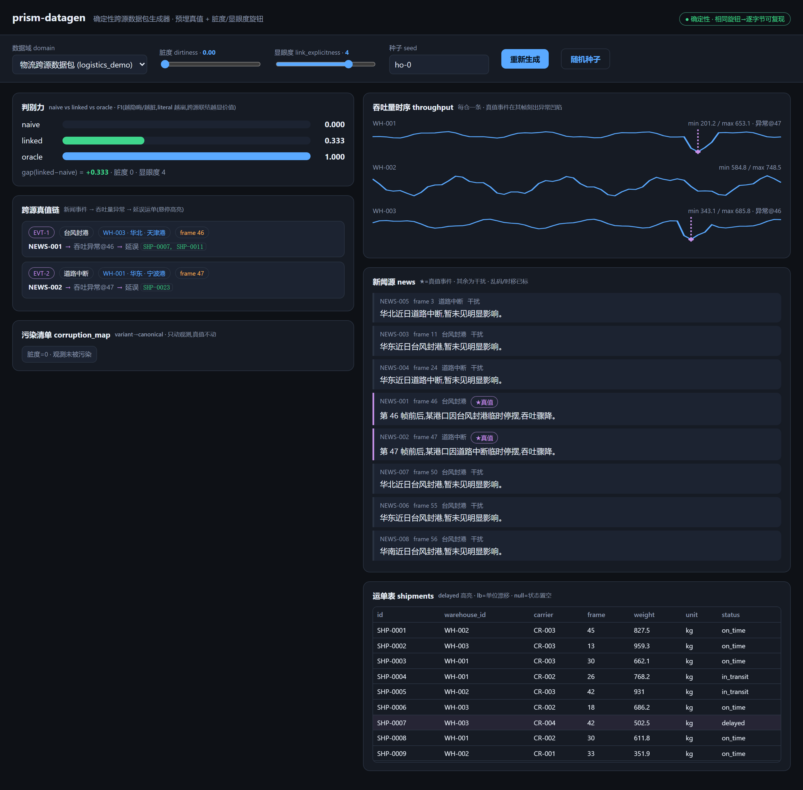
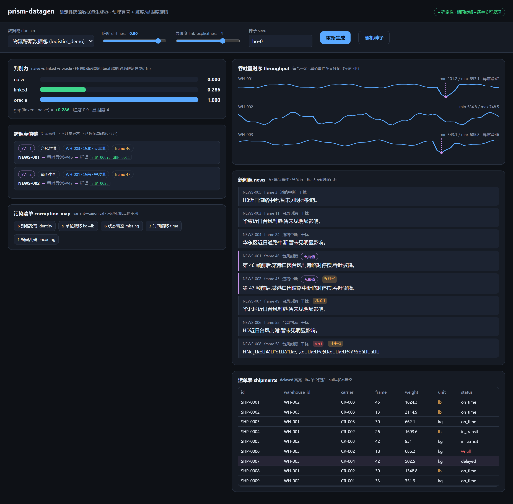
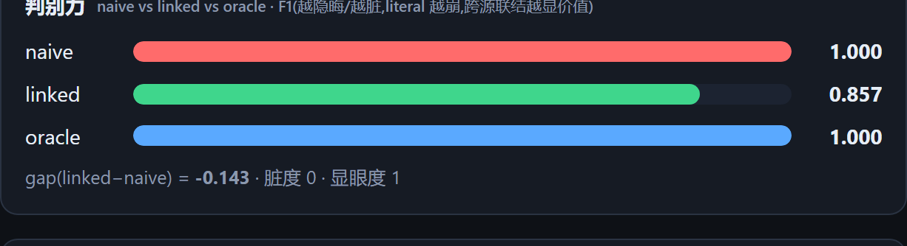
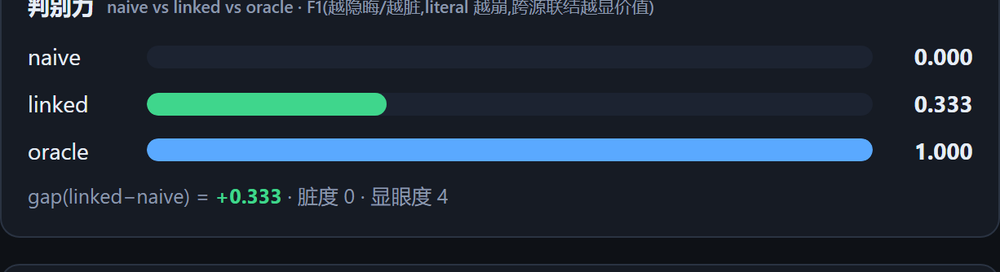
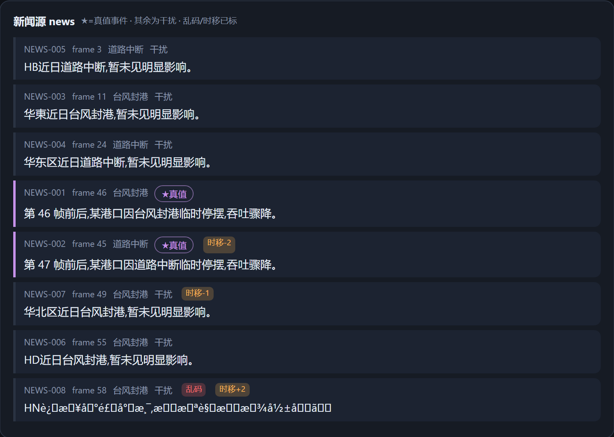
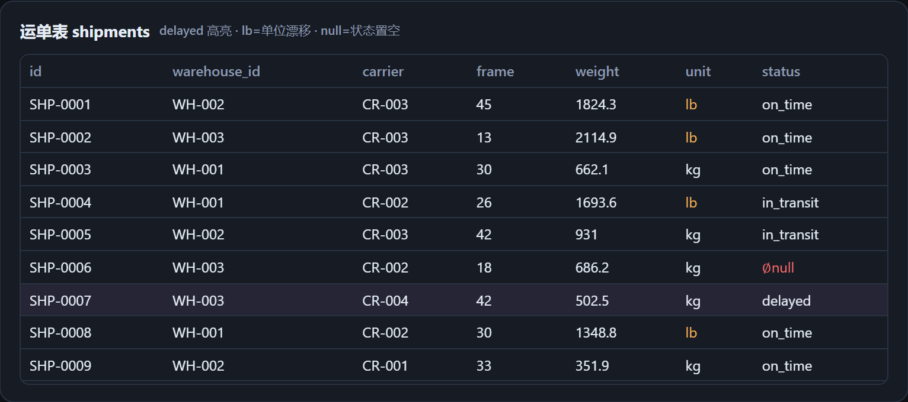

# prism-datagen 用户手册

> 确定性跨源数据包生成器（clean-room）——生成"带预埋、且始终可恢复的跨源因果真值"的脏数据基准。
>
> 本手册面向使用者，逐步可照做。每个可操作步骤都给出真实命令与预期输出片段。

---

## 目录

1. [简介与适用场景](#1-简介与适用场景)
2. [安装](#2-安装)
3. [CLI 全部用法](#3-cli-全部用法)
   - [3.1 `list` — 列出数据域](#31-list--列出数据域)
   - [3.2 `gen` — 生成一个数据包](#32-gen--生成一个数据包)
   - [3.3 `sweep` — 扫描一个旋钮](#33-sweep--扫描一个旋钮)
4. [输出文件说明](#4-输出文件说明)
   - [4.1 JSON](#41-json全量)
   - [4.2 CSV](#42-csv每-store-一个)
   - [4.3 SQLite](#43-sqlite真实可查询)
5. [Web UI 逐步操作](#5-web-ui-逐步操作)
6. [常见问题（FAQ）](#6-常见问题faq)
7. [优缺点（pros & cons）](#7-优缺点pros--cons)

---

## 1. 简介与适用场景

`prism-datagen` 生成一个**跨源数据集**，包含三种存储（store）：

- **SQL 关系表**：`shipments`（运单）/ `carriers`（承运商）/ `warehouses`（仓库）；
- **时序**：每个仓库一条 `throughput`（吞吐量）曲线；
- **新闻文本**：港口/天气类 `news` 条目。

它的核心特点是：数据集里**预埋了一条跨源因果真值链**——

```
新闻事件（news event） → 吞吐量异常（throughput anomaly） → 延误运单（delayed shipments）
```

这条真值**先建**，再让所有观测 store 与之保持一致。之后由两个旋钮**只污染/隐藏观测，永不改动真值**：

| 旋钮 | 取值 | 作用 |
| --- | --- | --- |
| `dirtiness` | 0–1 | 对观测施加 6 类污染：身份别名 / 单位漂移 kg→lb / 状态置空 / 时间偏移 / 数值冻结 / 编码乱码。全部记入 `corruption_map`（variant→canonical），可逆。 |
| `link_explicitness` | 1–5 | 新闻把"命中哪个仓 / 哪些运单"暴露得多显眼：L1 直接写 id … L5 纯语义。 |

**确定性**：相同的 `(seed, dirtiness, link, domain)` → **逐字节可复现**。底层用 sha256 把种子映射到 `[0,1]`，**不用 `random`、不读时钟**。

**判别力（discriminability）**：内置三个解法，用于衡量"这个任务是否真的需要跨源推理"：
- `oracle`：知道真值，是能力上限（F1 恒为 `1.000`）；
- `naive`：只做字面精确匹配、单源，不做跨源推理；
- `linked`：做基础的跨源时空 + 实体联结。

当 link 隐晦或脏度升高时，`naive` 崩溃、`linked` 仍能部分恢复 ⇒ 说明任务确实需要跨源推理。

**spec 驱动**：换 `vocab` / `roles` 就是换领域，**零生成器代码**改动。

### 适用场景

- 需要一个**答案永远可核验**的脏数据基准，用来评估跨源推理 / 实体解析 / 时空对齐类方法；
- 需要**逐字节可复现**的合成数据，便于回归测试与对照实验；
- 需要一个"干净真值 + 可调噪声"的沙盒，观察某解法在噪声/隐晦度上升时的鲁棒性曲线。

### 诚实边界（务必先读）

本项目有明确的能力边界，使用前请知悉：

- **数理分布是手设合成示意，未逆向自真实数据**（no real-data calibration）；仓库/运单数量、吞吐量范围、污染比例等都是手写常数。
- 确定性 `linked` 解法只区分 **L1（显式 key）vs L≥2（非显式）**；L2–L5 得分相同（约 `0.8`）。它是**未来 LLM / axiom 解法的确定性占位替身**，不是真正的语义求解器。
- `linked` 的满分是约 **`0.8` 而非 `1.0`**（骨架解法上限）。
- 鲁棒性下降是**跨多个 seed 的均值趋势**，并非逐 seed 单调——单个 seed 上污染偶尔会把边界匹配"歪打正着"，让分数不降反升。
- **没有** PDF / NoSQL 等多模态；**没有** LLM 基准跑（那是母项目 Prism 的另一条线，不在本包内）。
- clean-room：从个人学习沙盒中抽取，仅含本项目自有代码。

---

## 2. 安装

### 2.1 环境要求

- **Python ≥ 3.10**（源码使用 `str | None`、`dict | None` 等新式类型标注）。
- **核心零依赖**：`list` / `gen` / `sweep` 三个 CLI 子命令，以及 JSON / CSV / SQLite 三种输出，都只用 Python 标准库（`hashlib` / `json` / `csv` / `sqlite3` / `argparse`）。无需 `pip install` 任何东西。

### 2.2 获取与运行

进入项目根目录（即包含 `datagen/`、`server.py`、`web/` 的目录）后，直接以模块方式运行：

```bash
python -m datagen list
```

若能看到数据域列表（见 [3.1](#31-list--列出数据域)），说明核心功能已就绪。

### 2.3 Web UI 的额外依赖

只有本地 Web UI 需要额外安装两个包：

```bash
pip install fastapi uvicorn
```

装完后即可启动 [第 5 节](#5-web-ui-逐步操作) 的可视化界面。**如果你只用 CLI，则不需要安装它们。**

---

## 3. CLI 全部用法

所有命令都以 `python -m datagen <子命令>` 形式调用。共三个子命令：`list` / `gen` / `sweep`。

查看版本：

```bash
python -m datagen --version
# prism-datagen 1.0.0
```

### 3.1 `list` — 列出数据域

列出 `datagen/specs/` 下所有可用的数据域（spec）。

**命令：**

```bash
python -m datagen list
```

**预期输出：**

```
可用数据域(specs):
  logistics_demo       event_anomaly_delay  物流跨源数据包
```

三列分别是：spec `id`、`scenario`、`title`。默认随包只有一个 `logistics_demo`（物流场景）。后续 `gen` / `sweep` 的 `-D/--domain` 参数就填这里的 `id`。

### 3.2 `gen` — 生成一个数据包

生成一个数据包，把人读预览打印到 stdout；带 `-o` 时还会写文件。

**全部参数：**

| 参数 | 长名 | 默认 | 说明 |
| --- | --- | --- | --- |
| `-D` | `--domain` | `logistics_demo` | 数据域 spec id |
| `-d` | `--dirtiness` | `0` | 脏度，浮点 0..1 |
| `-l` | `--link` | `4` | link 显眼度，整数 1..5 |
| `-s` | `--seed` | （spec 内置 seed） | 随机种子字符串 |
| `-o` | `--out` | （不写文件） | 输出目录；给出才写文件 |
| `-f` | `--format` | `json` | 写文件格式：`json` / `csv` / `sqlite` / `all` |
| （无） | `--eval` | 关 | 同时打印 naive/linked/oracle 判别力 F1 |

> 说明：`dirtiness` 会被夹到 `[0,1]`，`link` 会被夹到 `[1,5]`；`seed` 不给时用 spec 里的默认 seed（`logistics_demo`）。

#### 例 1：带判别力评估的一次生成

**命令：**

```bash
python -m datagen gen -d 0.6 -l 4 -s ho-0 --eval
```

**预期输出（节选）：**

```
═══ 物流跨源数据包  (logistics_demo) ═══
seed=ho-0  dirtiness=0.6  link_explicitness=4
counts: {'warehouses': 3, 'carriers': 4, 'shipments': 24, 'news': 8, 'frames': 60, 'ground_truth_events': 2}

── 跨源真值(ground-truth · 始终保留,脏度不动它)──
  EVT-1  台风封港 @ WH-003/华北/天津港  frame=46  → 延误 ['SHP-0007', 'SHP-0011']
  EVT-2  道路中断 @ WH-001/华东/宁波港  frame=47  → 延误 ['SHP-0023']
  任务 explain_delays 答案(按新闻 id 键):{'NEWS-001': ['SHP-0007', 'SHP-0011'], 'NEWS-002': ['SHP-0023']}

── 污染清单(corruption_map · variant→canonical,dirtiness=0.6)──
  别名改写(identity):5 处   {'HB': '华北', '华東': '华东', ...}
  单位漂移 kg→lb(unit):5 条   ['SHP-0002', 'SHP-0004', 'SHP-0011', 'SHP-0016', 'SHP-0024']
  状态置空(missing):5 条   ['SHP-0014', 'SHP-0015', 'SHP-0016', 'SHP-0019', 'SHP-0022']
  编码乱码(encoding):1 条   ['NEWS-008']

...（观测样本略）...

── 判别力(naive vs linked vs oracle · F1)──
  naive=0.000  linked=0.333  oracle=1.000  gap(linked−naive)=+0.333
```

**读法：**
- **真值链**：EVT-1 台风封港命中 WH-003（frame 46）→ 延误 `SHP-0007`, `SHP-0011`；EVT-2 命中 WH-001（frame 47）→ 延误 `SHP-0023`。
- **答案**（按新闻 id 键）：`{NEWS-001: [SHP-0007, SHP-0011], NEWS-002: [SHP-0023]}`——供解法对照打分。
- **污染清单**：本次生成了别名 5 处、单位漂移 5 条、状态置空 5 条、编码乱码 1 条。
- **判别力**：`naive=0.000`（字面匹配在 L4 完全找不到）、`linked=0.333`（脏度 0.6 下部分恢复）、`oracle=1.000`，`gap=+0.333`。

> 提示：污染条目的具体数量随 seed 变化。上面这些数字对应 `seed=ho-0, d=0.6`。

#### 例 2：写出全部三种格式

**命令：**

```bash
python -m datagen gen -D logistics_demo -o examples --format all
```

**预期输出（末尾"已写出"段）：**

```
── 已写出 ──
  examples/logistics_demo_d0.0_l4_logistics_demo.json
  examples/logistics_demo_d0.0_l4_logistics_demo_csv/warehouses.csv
  examples/logistics_demo_d0.0_l4_logistics_demo_csv/carriers.csv
  examples/logistics_demo_d0.0_l4_logistics_demo_csv/shipments.csv
  examples/logistics_demo_d0.0_l4_logistics_demo_csv/throughput.csv
  examples/logistics_demo_d0.0_l4_logistics_demo_csv/news.csv
  examples/logistics_demo_d0.0_l4_logistics_demo.db
```

文件名 stem 规则为 `<domain>_d<dirtiness>_l<link>_<seed>`（这里没指定 `-s`，seed 用 spec 默认值 `logistics_demo`，`-d` 默认 0.0）。

- `.json`：全量包（单文件）；
- `_csv/`：一个目录，每个 store 一个 CSV；
- `.db`：SQLite 数据库。

> 只想要某一种格式时，把 `--format all` 换成 `json` / `csv` / `sqlite` 即可。默认（不写 `-f`）只写 `json`。

### 3.3 `sweep` — 扫描一个旋钮

固定一个旋钮，让另一个在若干档位上扫描，逐档打印判别力（`--over link`）或鲁棒性（`--over dirtiness`）曲线。

**参数：**

| 参数 | 默认 | 说明 |
| --- | --- | --- |
| `-D` / `--domain` | `logistics_demo` | 数据域 |
| `--over` | `dirtiness` | 扫描哪个旋钮：`dirtiness` 或 `link` |
| `-s` / `--seed` | （spec 默认） | 种子 |

- `--over link`：`dirtiness` 固定 0.0，`link` 取 `1,2,3,4,5`；
- `--over dirtiness`：`link` 固定 4，`dirtiness` 取 `0.0, 0.3, 0.6, 0.9`。

#### 例 1：扫描 link 显眼度

**命令：**

```bash
python -m datagen sweep --over link
```

**预期输出：**

```
扫描 link(domain=logistics_demo, seed=(spec default))
        link | naive_f1  linked_f1  gap
  --------------------------------------------
           1 |   1.000     0.800  -0.200
           2 |   0.000     0.800  +0.800
           3 |   0.000     0.800  +0.800
           4 |   0.000     0.800  +0.800
           5 |   0.000     0.800  +0.800

  说明:link 越隐晦 / 脏度越高,naive 越崩,linked(跨源联结)越能显出价值 —— 判别区间。
```

**读法：**
- **L1**：新闻直接写出运单 id，字面匹配 `naive=1.000` 反而满分、`linked=0.800`，`gap=-0.200`——此档不需要跨源推理。
- **L2–L5**：一旦不再显式写 id，`naive=0.000` 立刻崩溃，`linked` 仍维持 `0.800`，`gap=+0.800`——这就是"判别区间"。
- 注意 L2–L5 得分完全相同（都是 `0.800`）：确定性 `linked` 只区分"有没有显式 key"，L2→L5 的细粒度语义梯度留给未来 LLM/axiom 解法。

#### 例 2：扫描 dirtiness 脏度

**命令：**

```bash
python -m datagen sweep --over dirtiness
```

**预期输出：**

```
扫描 dirtiness(domain=logistics_demo, seed=(spec default))
   dirtiness | naive_f1  linked_f1  gap
  --------------------------------------------
         0.0 |   0.000     0.800  +0.800
         0.3 |   0.000     0.571  +0.571
         0.6 |   0.000     0.500  +0.500
         0.9 |   0.000     0.500  +0.500

  说明:link 越隐晦 / 脏度越高,naive 越崩,linked(跨源联结)越能显出价值 —— 判别区间。
```

**读法：**在 L4 下 `naive` 恒为 `0.000`；`linked` 随脏度上升从 `0.800` 逐步下降到 `0.500`——这是鲁棒性曲线。

> 重要：上表是**这一个 seed** 的结果。诚实边界里提到过——**逐 seed 未必单调**：在其他 seed 上，污染偶尔会把某个边界匹配"歪打正着"，使某一档反而略升。要看总体趋势，应跨多个 seed 取均值。

---

## 4. 输出文件说明

`gen -o <目录> --format <fmt>` 会按 `<domain>_d<dirtiness>_l<link>_<seed>` 命名规则写出。三种格式各有用途。

### 4.1 JSON（全量）

单个 `.json` 文件（UTF-8，`ensure_ascii=False`，缩进 2），包含**整个包**：

- `stores`：`sql`（warehouses/carriers/shipments）、`timeseries`（throughput + frames）、`news`；
- `ground_truth`：`events`（真值事件）、`answers`（两个任务的标准答案）、`window`；
- `corruption_map`：variant→canonical 的可逆污染记录；
- `manifest`：标题、seed、旋钮、各 store 计数、scope/honesty 注记；
- `roles` / `tasks`。

适合：程序化读取全部信息（含真值与污染映射），做解法评测。

### 4.2 CSV（每 store 一个）

`--format csv` 写出一个 `<stem>_csv/` 目录，内含：

| 文件 | 内容 |
| --- | --- |
| `warehouses.csv` | 仓库表（列 = 该 store 自身字段） |
| `carriers.csv` | 承运商表 |
| `shipments.csv` | 运单表 |
| `throughput.csv` | 长表格式：三列 `hub_id, frame, value` |
| `news.csv` | 新闻表（内部 `_` 前缀字段已剔除） |

所有 CSV 以 `utf-8-sig`（带 BOM）编码写出，Excel 打开中文不乱码。

适合：直接用 Excel / pandas 查看观测数据。注意 CSV **只含观测**，不含真值答案（真值在 JSON 里）。

### 4.3 SQLite（真实可查询）

`--format sqlite` 写出一个 `.db` 文件，是**真正可用 SQL 查询的关系库**。它只物化 **SQL store 的三张表**：`warehouses` / `carriers` / `shipments`（每个 store 一张表，列从该 store 自身 schema 推断，`id` 列作为主键）。时序与新闻不进 db（它们在 CSV / JSON 里）。

**用 `sqlite3` 命令行查询示例：**

```bash
sqlite3 examples/logistics_demo_d0.0_l4_logistics_demo.db
```

进入后：

```sql
-- 看有哪些表
.tables
-- 输出: carriers  shipments  warehouses

-- 看 shipments 表结构
.schema shipments

-- 查所有延误运单
SELECT id, warehouse_id, status FROM shipments WHERE status='delayed';
```

**预期输出（形如，具体行随 seed/旋钮变化）：**

```
SHP-0005|WH-003|delayed
SHP-0009|WH-002|delayed
SHP-0010|WH-002|delayed
SHP-0019|WH-003|delayed
```

`shipments` 表的列为：`id, warehouse_id, carrier_id, dispatch_frame, weight_kg, status, unit`。

也可用 Python 查询：

```python
import sqlite3
con = sqlite3.connect("examples/logistics_demo_d0.0_l4_logistics_demo.db")
rows = con.execute(
    "SELECT id, warehouse_id, unit FROM shipments WHERE unit='lb'"
).fetchall()
print(rows)   # 单位漂移到 lb 的运单
con.close()
```

适合：需要真实关系查询能力（JOIN、WHERE、聚合）来构造解法或核对观测的场景。

---

## 5. Web UI 逐步操作

本地单页可视化界面，把两个旋钮做成滑块、实时重生成，并可视化真值链与污染。UI 与 CLI 走的是**同一个确定性生成器**，不是另一套代码路径。

### 步骤 0 — 安装依赖并启动 server

先确保已安装 UI 依赖（见 [2.3](#23-web-ui-的额外依赖)）：

```bash
pip install fastapi uvicorn
```

在项目根目录启动：

```bash
python server.py
```

**预期看到**：控制台打印 uvicorn 启动信息，监听在 `http://127.0.0.1:8123`。保持该窗口开着。

### 步骤 1 — 打开页面，看全局默认视图

浏览器访问 **`http://127.0.0.1:8123`**。


**预期看到**：页面默认以 `脏度 0.6 / 显眼度 4 / seed = ho-0` 载入。左列自上而下是"判别力"条形图、"跨源真值链"、"污染清单 corruption_map"；右列是"吞吐量时序 throughput"、"新闻源 news"、"运单表 shipments"。右上角有绿色徽标"● 确定性 · 相同旋钮→逐字节可复现"。

### 步骤 2 — 认识顶部控制条


**预期看到**：顶部控制条从左到右为——数据域下拉框（`domain`）、脏度滑块（`dirtiness`，0–1，步进 0.05）、显眼度滑块（`link_explicitness`，1–5，步进 1）、种子文本框（`seed`）、"重新生成"按钮、"随机种子"按钮。每个滑块旁的数值会实时反映当前值。

### 步骤 3 — 把脏度拖到 0，看干净基线

把脏度滑块拖到最左端（`0.00`）。



**预期看到**：滑块数值变为 `0.00`；污染清单显示"脏度=0 · 观测未被污染"这一条灰色 chip；运单表里没有 lb 单位漂移、没有 `∅null` 状态；新闻源没有"乱码 / 时移"标记。真值链与吞吐量凹陷仍在——**脏度不动真值**。

### 步骤 4 — 把脏度拖到 0.9，看重污染

把脏度滑块拖到接近最右端（`0.90`）。



**预期看到**：滑块数值变为 `0.90`；污染清单 chip 上的计数明显变大（别名 / 单位漂移 / 状态置空 / 时间偏移 / 编码乱码各类都出现）；运单表里出现橙色 `lb` 单位与红色 `∅null` 状态；部分新闻条目带上"乱码""时移±N"标记。判别力条中 `linked` 的分数相比干净时下降。

### 步骤 5 — 观察污染清单特写


**预期看到**：污染清单卡片里一排 chip，每个 chip 前的橙色数字是该类污染的条数：别名改写 identity、单位漂移 kg→lb、状态置空 missing、时间偏移 time、编码乱码 encoding。这就是 `corruption_map` 的可逆记录（variant→canonical）。

### 步骤 6 — 把显眼度拖到 L1，看 naive 满分

把显眼度滑块拖到 `1`（同时可把脏度先拖回 0 便于观察）。



**预期看到**：新闻正文里直接出现运单 id（如"受影响运单:SHP-xxxx"）；判别力条中 `naive` 接近满分、`linked` 约 0.8，`gap` 为负——此档**不需要**跨源推理。

### 步骤 7 — 把显眼度拖到 L4，看 naive 崩溃

把显眼度滑块拖到 `4`。



**预期看到**：新闻正文不再写出仓库/运单 id（只剩"某港口…吞吐骤降"这类措辞）；判别力条中 `naive` 掉到 0（红色条几乎空）、`linked` 仍维持约 0.5–0.8，`gap` 明显为正——这正是"判别区间"。

### 步骤 8 — 悬停真值链，看跨源联动高亮

把鼠标悬停在"跨源真值链"卡片中某一条（如 `EVT-1`）上。


**预期看到**：该条边框变紫并高亮；同时——右侧对应仓库的吞吐量曲线被高亮、该事件命中的延误运单行在运单表里被描边、对应新闻条目也被点亮。这直观展示了"新闻 → 吞吐异常 → 延误运单"的跨源关联。

### 步骤 9 — 查看新闻源



**预期看到**：新闻列表中，真值事件条目左侧为紫色边并带 `★真值` 标签，其余为"干扰"。被污染的条目会附带"乱码"（红）或"时移±N"（橙）小标。列表按 frame 排序。

### 步骤 10 — 查看运单表



**预期看到**：运单表列为 `id / warehouse_id / carrier / frame / weight / unit / status`。`delayed`（延误）行有淡紫背景高亮；单位漂移的行 `unit` 显示橙色 `lb`；状态被置空的行 `status` 显示红色 `∅null`。

### 步骤 11 — 换种子 / 随机种子

在种子文本框里输入一个新字符串（如 `ho-3`）后按回车，或点击"随机种子"按钮。

**预期看到**：点击"随机种子"会把种子设为 `ho-0`…`ho-7` 之一并立即重生成；页面所有数据（真值链、吞吐、新闻、运单、判别力）随之刷新为新一份**确定性**结果。**同一个种子 + 同样旋钮永远得到同一份数据**——想要不同数据，就换种子。

---

## 6. 常见问题（FAQ）

**Q1：Windows 控制台里中文/预览文本乱码或报编码错误？**
CLI 已在启动时尝试把 stdout/stderr 重配为 UTF-8。若你的终端仍是 GBK 且出现问题，运行前设置环境变量：

```bash
# PowerShell
$env:PYTHONIOENCODING = "utf-8"
python -m datagen gen -s ho-0

# bash / Git Bash
PYTHONIOENCODING=utf-8 python -m datagen gen -s ho-0
```

**Q2：`python server.py` 报端口占用 / `8123` 被占？**
Web UI 固定监听 `127.0.0.1:8123`。若该端口被占用，请先关闭占用它的进程，或临时改用其它端口——例如用 uvicorn 直接指定端口启动：

```bash
python -m uvicorn server:app --host 127.0.0.1 --port 8124
```

然后浏览器访问 `http://127.0.0.1:8124`。

**Q3：为什么每次生成的数据都一模一样？**
这是**设计如此**——生成器是确定性的，相同 `(seed, dirtiness, link, domain)` 逐字节可复现，不用 `random`、不读时钟。想要不同数据，**请更换 `-s/--seed`**（或在 UI 里点"随机种子"）。只改脏度/显眼度会改变观测，但真值与整体结构由 seed 决定。

**Q4：启动 UI 时报 `No module named fastapi` / `uvicorn`？**
UI 依赖没装。执行 `pip install fastapi uvicorn` 即可。CLI 不需要它们。

**Q5：`gen` 报"未知数据域 '...'"？**
`-D/--domain` 填的 id 不存在。先用 `python -m datagen list` 查看可用 id（默认只有 `logistics_demo`）。

**Q6：SQLite 里为什么只有 3 张表，没有吞吐量和新闻？**
SQLite 只物化关系型 SQL store（warehouses/carriers/shipments）。时序与新闻请到同次生成的 CSV 目录（`throughput.csv` / `news.csv`）或 JSON 里取。

---

## 7. 优缺点（pros & cons）

### 优点

- **零依赖上手快**：核心 CLI 与三种输出只用标准库，`python -m datagen list` 一条命令即可验证环境，无需搭建。
- **答案永远可核验**：真值先建、始终保留，`gen --eval` 直接给出 naive/linked/oracle 三档 F1 与 gap，判别力一目了然。
- **逐字节可复现**：sha256 种子、无 random 无时钟，跨机器结果一致，天然适合回归测试与对照实验。
- **两界面互补**：CLI 适合脚本化与批量 `sweep`；本地 Web UI 用滑块实时调旋钮、悬停即看跨源联动高亮，直观易懂。
- **多格式落地**：一条 `--format all` 同时产出 JSON（全量含真值）/ 每 store 一个 CSV（Excel 友好，带 BOM）/ 真实可查询 SQLite，覆盖不同下游用法。
- **诚实自证**：`manifest` 内置 scope/honesty 注记，污染全部记入可逆的 `corruption_map`，边界不藏着掖着。

### 缺点 / 局限

- **未用真实数据校准**：所有数理分布是**手设合成示意**（no real-data calibration），仓库/运单数量、吞吐范围、污染比例都是手写常数，不代表真实业务分布。
- **`linked` 解法是占位替身**：确定性 `linked` 只区分 L1（显式 key）vs L≥2（非显式），**L2–L5 得分完全相同（约 0.8）**，无法体现 L2→L5 的语义梯度；它是未来 LLM/axiom 解法的**确定性占位替身**，不是真正的语义求解器。
- **`linked` 满分只有约 0.8**：这是骨架解法的上限，不是 1.0；据此评估时不要把 0.8 当"做满了"。
- **鲁棒性曲线非逐 seed 单调**：脏度上升 → linked 下降是**跨多个 seed 的均值趋势**；单个 seed 上污染偶尔会把边界匹配"歪打正着"，某一档反而略升。看单条 sweep 输出时勿过度解读。
- **模态与基准受限**：**没有** PDF / NoSQL 等多模态存储；**没有** LLM 基准跑（那属母项目 Prism 另一条线，不在本包内）。SQLite 也只物化 SQL 三表，时序/新闻不入库。
- **默认只有一个数据域**：随包只带 `logistics_demo`。换领域虽"零生成器代码"，但需要自己动手写一份 spec（vocab/roles）。
- **UI 有额外门槛且不可配置**：Web UI 需额外 `pip install fastapi uvicorn`，且端口硬编码为 `8123`（如需改端口要绕道用 `uvicorn` 命令启动）。
